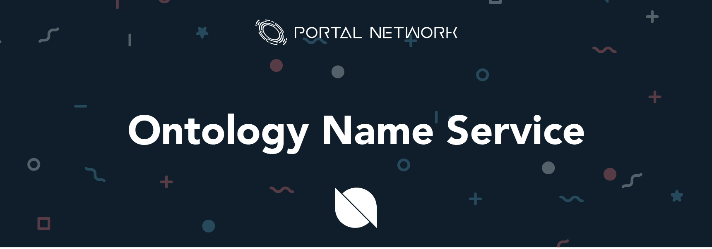

> 📖🔍 Documents of the Ontology Name Service.

# Overview

## What is Ontology?
Ontology is a public chain which dedicated to let projects of all shapes and sizes. The Ontology network combines distributed identity system, distributed data exchange, distributed data collaboration, distributed procedure protocols, distributed communities, distributed attestation, and various industry-specific modules. Via integrating all the infrastructures together, Ontology becomes a trust network which is cross-chain, cross-system, cross-industry, cross-application, and cross-device.

## 💡 What is BNS?
BNS – or blockchain name system – is the protocol on the internet that turns human-comprehensible decentralized website names such as 'website.neo' or 'mywebsite.ont' into addresses understandable by decentralized network machines.

## 📝 Description

ONS is the Ontology Name Service, a distributed, open, and extensible naming system based on the Ontology blockchain.

## 📚 Documents

#### Table of Contents
- [Introduction](./docs/INTRODUCTION.md)
- [Tutorial](./docs/TUTORIAL.md)

## 📝 Ontology in Web3.0
Ontology plays an connecting and entry layer in Web3.0 services. It connects with Ontology wallet, ONT ID, blockchain server and decentralized resources.

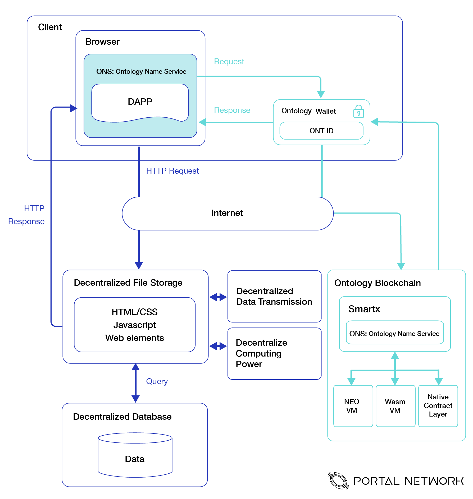

## 🗂️ Ontology Technical Stack
Along down with the y-axis, the following picture shows the Web3 technical stacks of Ontology ecosystem. Each of the layer is based on the modules of the last one and the fundamental base of all layers is the state layer which is Ontology protocol. The rapidly evoling development on each layer brings the infrastructure more mature, and that is crucial to give the robustness of Web3.
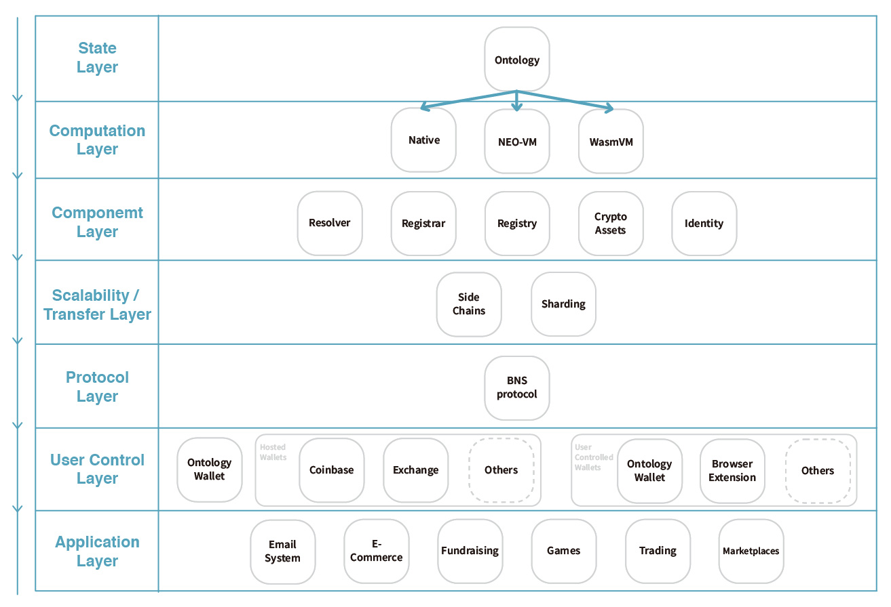

### State Layer
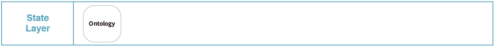

### Computation Layer
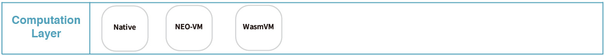

### Component Layer
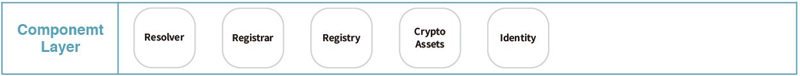

### Scalability / Transfer Layer
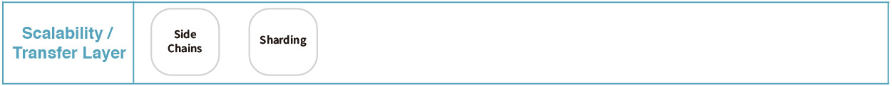

### Protocol Layer
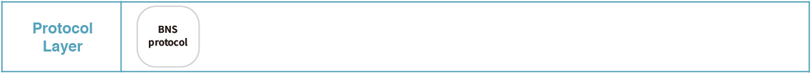

### User Control Layer
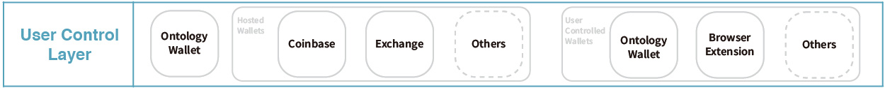


### Application Layer


# Introduction

## Install Ontology

Clone the source code and install dependency
```
$ go get github.com/ontio/ontology
$ cd $GOPATH/src/github.com/ontio/ontology
$ glide install
```

Make source code
```
$ make all
```

## Create wallet

```
./ontology account add -d
```

Will create an ontology wallet
```
Use default setting '-t ecdsa -b 256 -s SHA256withECDSA'
	signature algorithm: ecdsa
	curve: P-256
	signature scheme: SHA256withECDSA
Password:
Re-enter Password:
Index:2
Label:
Address:AbfNqEyvZJuNzguXTSP6sbioySZpsdYfeY
Public key:03ed07576c4d745edc6dd8938fc7cd24301523d6f95f71c4fc6b283c7184bffcfd
Signature scheme:SHA256withECDSA
Create account successfully.
```

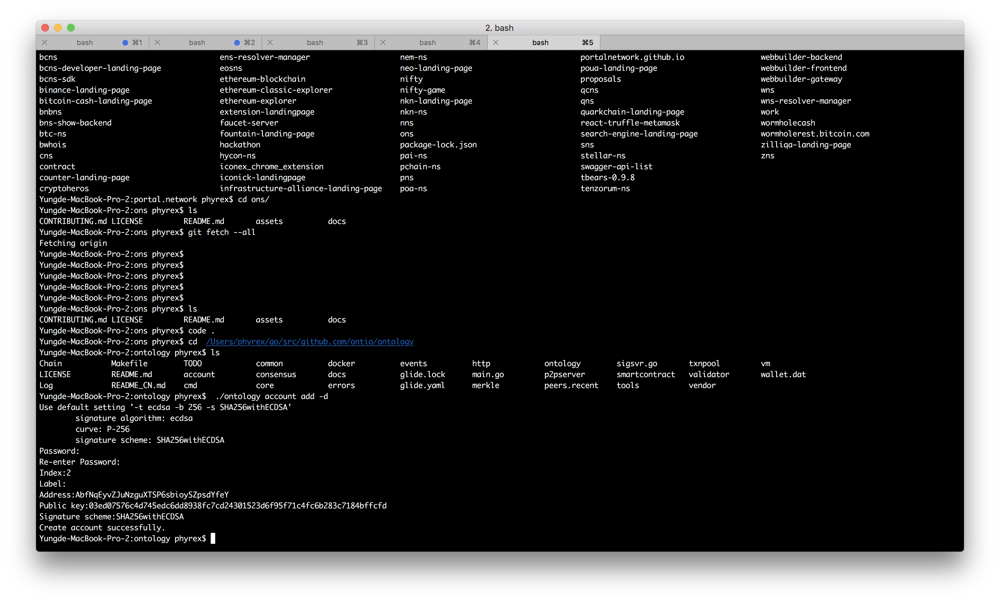

## Start testnet
```
./ontology --networkid 2
```

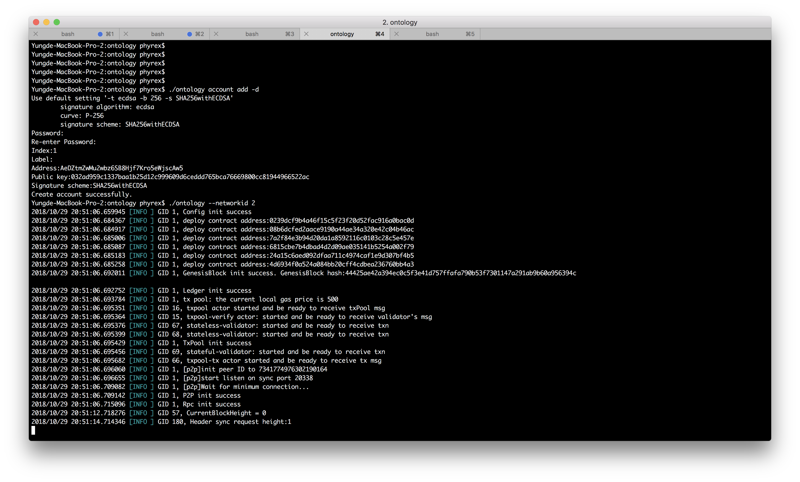

## Smart Contract

Using smartx
- [https://smartx.ont.io/](https://smartx.ont.io/)

Smart Contract Language
- C#
- Python
- JavaScript (Coming soon)

#### Choosing smartx language
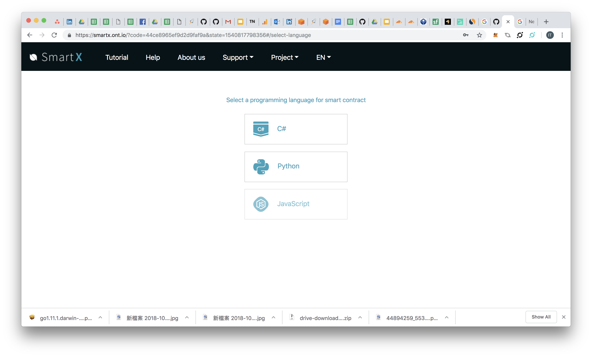

#### Choosing a smartx template, using "Domain"
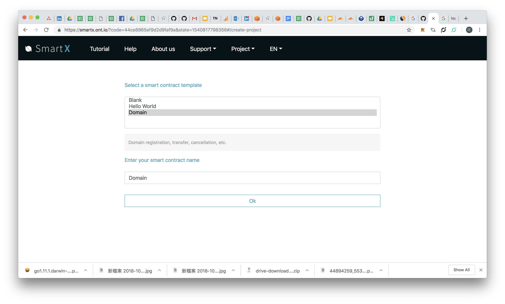

#### Source code
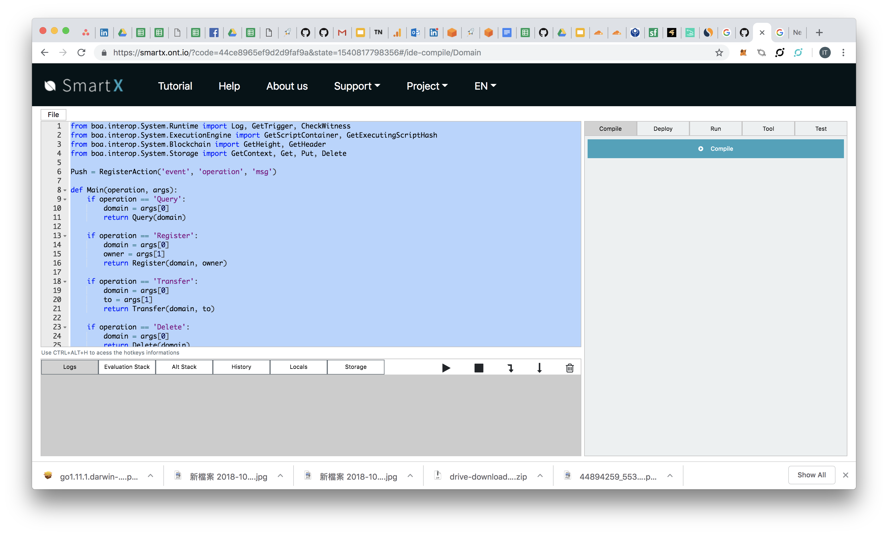

#### Compile smartx
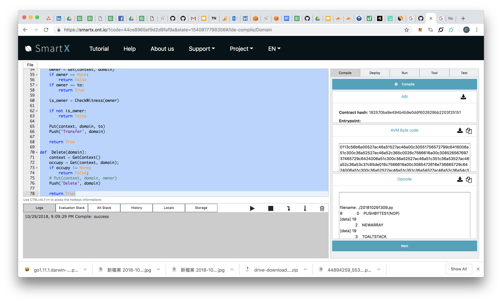

## 📣 Contributing
See [CONTRIBUTING.md](./CONTRIBUTING.md) for how to help out.

## 🗒 Licence
See [LICENSE](./LICENSE) for details.
