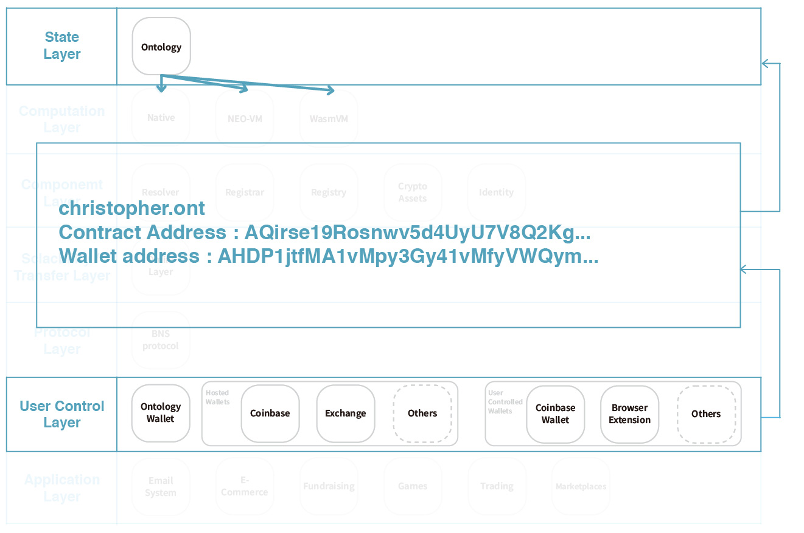

> 📖🔍 Documents of the Ontology Name Service.

# Overview

## What is Ontology?
Ontology is a public chain which dedicated to letting projects of all shapes and sizes. The Ontology network combines a distributed identity system, distributed data exchange, distributed data collaboration, distributed procedure protocols, distributed communities, distributed attestation, and various industry-specific modules. Via integrating all the infrastructures together, Ontology becomes a trust network which is cross-chain, cross-system, cross-industry, cross-application, and cross-device.

## 💡 What is BNS?
BNS – or blockchain name system – is the protocol on the internet that turns human-comprehensible decentralized website names such as 'website.neo' or 'mywebsite.ont' into addresses understandable by decentralized network machines.

## 📝 Description

ONS is the Ontology Name Service, a distributed, open, and extensible naming system based on the Ontology blockchain.

## 📚 Documents

#### Table of Contents
- [Introduction](./docs/INTRODUCTION.md)
- [Tutorial](./docs/TUTORIAL.md)

## 📝 Ontology in Web3.0
Ontology plays an connecting and entry layer in Web3.0 services. It connects with Ontology wallet, ONT ID, blockchain server and decentralized resources.


## 🗂️ Ontology Technical Stack
Along down with the y-axis, the following picture shows the Web3 technical stacks of Ontology ecosystem. Each of the layers is based on the modules of the previous one and the fundamental base of all layers is the state layer which is Ontology protocol. The rapidly evolving development on each layer brings the infrastructure more mature, and that is crucial to give the robustness of Web3.


### State Layer
Ontology protocol provides a robust trust network system to allow many business cases can be implemented on top of it. This layer is a crucial part for the Web3, because each of the layer stores related state information in this network, users can now own and control their identities and operations towards the decentralized web services.


### Computation Layer
There are three systems that provide the functionalities allowing humans to instruct the state layer to do what rules are been made. Ontology core has native support some of the smart contract features, NEO-VM / WasmVM for compiling different smart contracts programmed by various dynamic languages.


### Component Layer
The component layer is built on top of the computation layer. The components are set of standardized smart contract templates or with specific patterns. Such as OEP-4 described what the standard token interface should have. The designs of a new type of digital value components and much more experimentation expands more business possibilities.


### Scalability / Transfer Layer
There are multiple scalability enhancement solutions on layer1 and layer2. The solutions allow the decentralized network to increase the transaction processing capacity. Ontology will take the sub-chains, side-chains, and storage sharding as the higher priority in researching and developing.


### Protocol Layer
Ontology Name Service contains three main components, registrar, registry, and resolver smart contract components, these contracts are in charge of the registering ownership of the domain, storing the ownership of the domain, and the mapping information for the domain. BNS protocol can facilitate the Ontology Name Service to enhance the usability, reduce the complexity, and keep the flexibility.


### User Control Layer
The main part of the user control layer is how users manage their accounts. If there is no wallet application supporting the blockchain protocol, the user will have to interact via the command line interface to manage their private keys, transactions, and any operations on-chain. The user experience of this layer has a great impact on the blockchain adoption.



### Application Layer
By utilizing the technologies provided by different layers above, there comes out various real use cases and opportunities. If a blogger or any content creator wants to accept crypto assets as the payment, they can utilize the Ontology domain names governs by the smart contract for their receiving wallet address. For example, send any tokens on Ontology via simply typing 'yourfriend.ont' and that's it.


# Introduction

## Install Ontology

Clone the source code and install dependency
```
$ go get github.com/ontio/ontology
$ cd $GOPATH/src/github.com/ontio/ontology
$ glide install
```

Make source code
```
$ make all
```

## Create wallet

```
./ontology account add -d
```

Will create an ontology wallet
```
Use default setting '-t ecdsa -b 256 -s SHA256withECDSA'
	signature algorithm: ecdsa
	curve: P-256
	signature scheme: SHA256withECDSA
Password:
Re-enter Password:
Index:2
Label:
Address:AbfNqEyvZJuNzguXTSP6sbioySZpsdYfeY
Public key:03ed07576c4d745edc6dd8938fc7cd24301523d6f95f71c4fc6b283c7184bffcfd
Signature scheme:SHA256withECDSA
Create account successfully.
```


## Start testnet
```
./ontology --networkid 2
```


## Smart Contract

Using smartx
- [https://smartx.ont.io/](https://smartx.ont.io/)

Smart Contract Language
- C#
- Python
- JavaScript (Coming soon)

#### Choosing smartx language


#### Choosing a smartx template, using "Domain"


#### Source code


#### Compile smartx


## 📣 Contributing
See [CONTRIBUTING.md](./CONTRIBUTING.md) for how to help out.

## 🗒 Licence
See [LICENSE](./LICENSE) for details.
